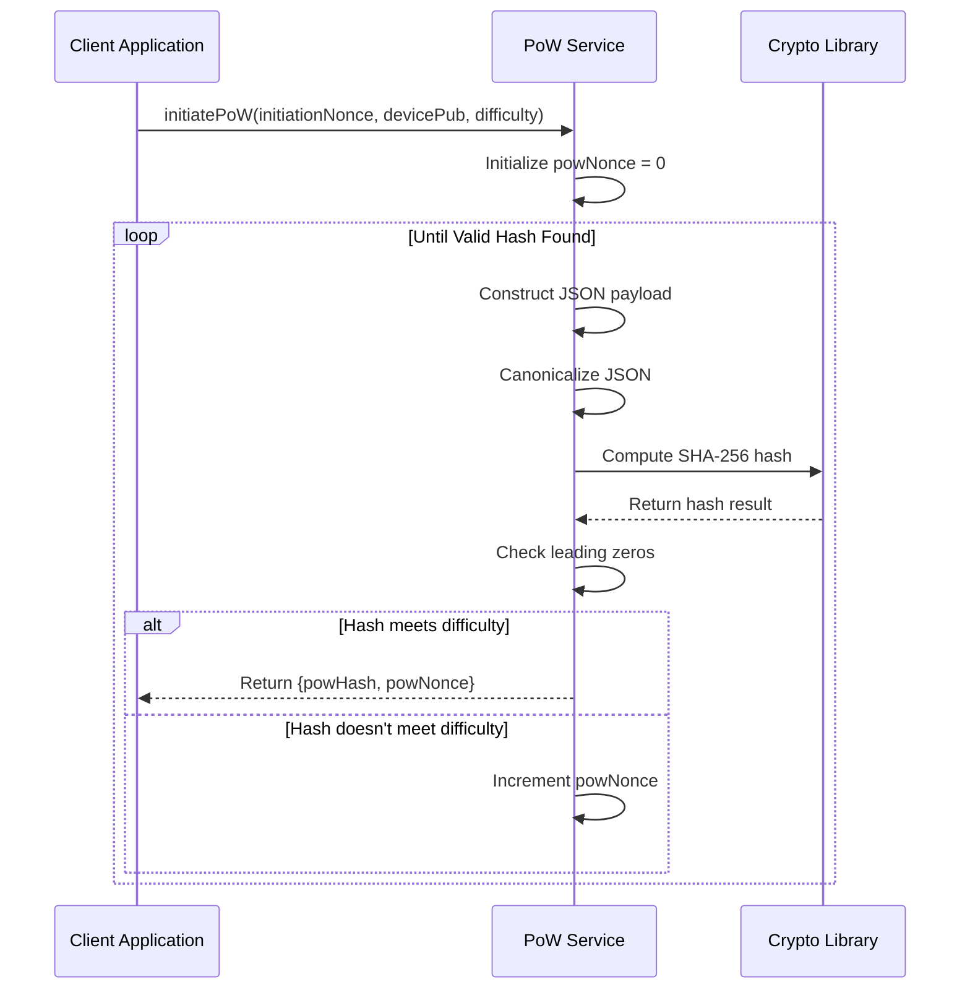
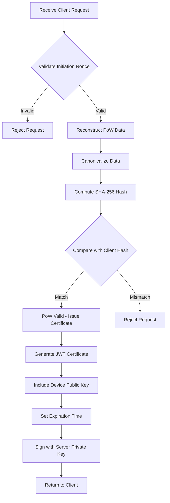
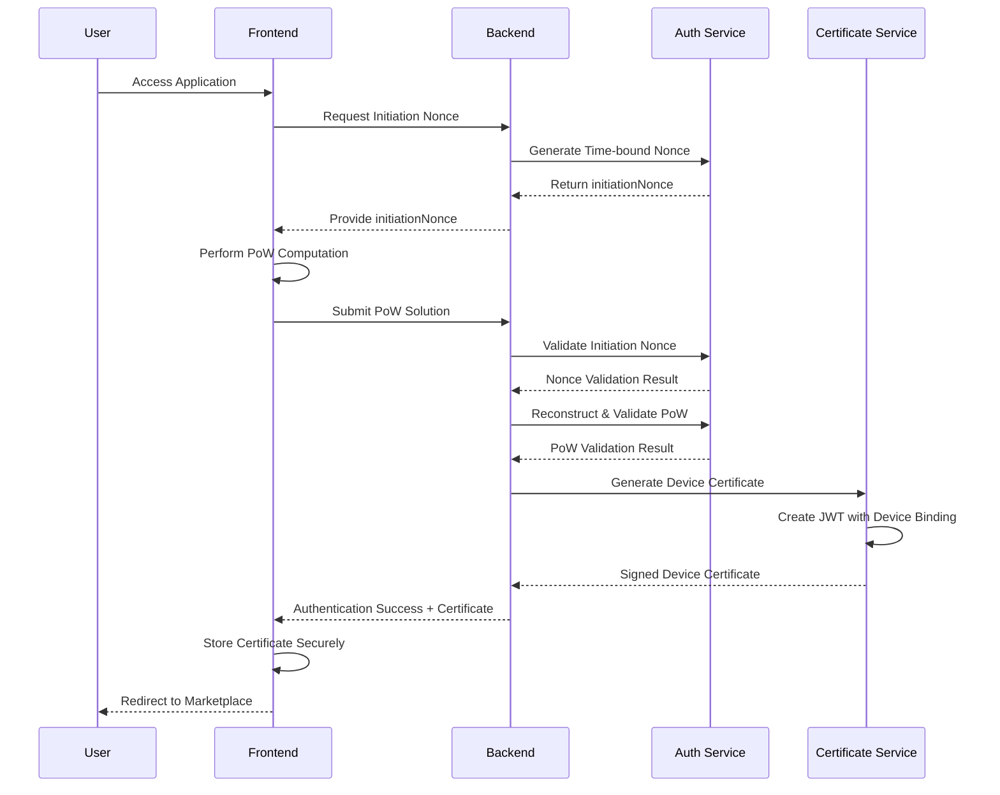
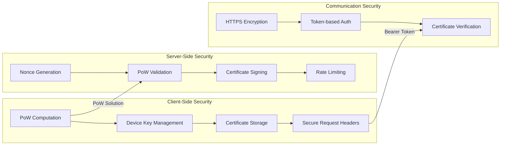
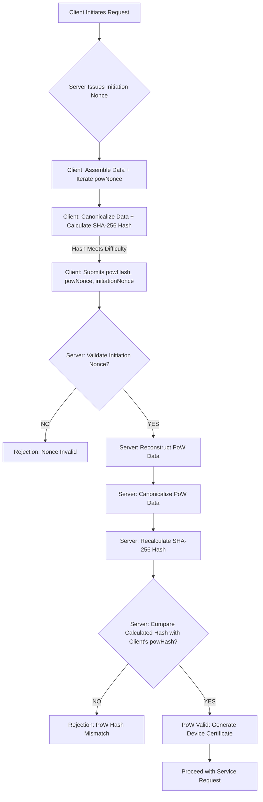

# Transac Proof of Work (PoW) Implementation - Complete Workflow Documentation

## Overview

This document provides a comprehensive overview of the Proof of Work (PoW) implementation in the Transac B2B marketplace application. The PoW mechanism serves as a security layer to prevent spam, ensure device authenticity, and protect backend resources from abuse.

## 1. Core Principles

The PoW mechanism in Transac relies on the following fundamental principles:

*   **Deterministic Hashing**: SHA-256 algorithm ensures consistent hash outputs for identical inputs, critical for server-side verification
*   **Canonicalization**: JSON objects are converted to canonical form before hashing, eliminating formatting variations
*   **Nonce-based Challenge**: Dual nonce system with server-generated initiation nonce and client-generated PoW nonce
*   **Server-Side Verification**: Server validates client solutions without performing the computation itself
*   **Device Binding**: Cryptographic binding to device identity prevents solution reuse

## 2. Key Data Elements for PoW

The PoW computation uses a structured data payload containing essential information:

*   **Initiation Nonce**: Server-generated, time-bound unique identifier ensuring challenge freshness
*   **Device Public Key**: Client's cryptographic identity, binding the solution to a specific device
*   **PoW Nonce**: Client-generated number iterated until a valid hash is found
*   **Difficulty Target**: Number of required leading zeros in the hash output

## 3. Implementation Workflow

### 3.1 Frontend (Client-Side) Implementation

The frontend PoW implementation follows a structured computational process:

#### Client-Side Process Details:

1. **Challenge Reception**: Client receives initiation nonce from server during initial authentication request
2. **Data Assembly**: Client collects initiation nonce, device public key, and begins generating powNonce values
3. **Iterative Hashing**: For each powNonce value:
   - Constructs JSON payload: `{initiationNonce, devicePub, powNonce}`
   - Canonicalizes payload using json-canonicalize library
   - Computes SHA-256 hash of canonicalized payload
4. **Difficulty Check**: Client repeatedly generates powNonce values until finding a hash that meets the difficulty target (specific number of leading zeros)
5. **Solution Submission**: Client submits valid solution (powHash, powNonce, initiationNonce) to server

### 3.2 Backend (Server-Side) Implementation

The backend implements a comprehensive validation and certificate generation system:

#### Server-Side Validation Process:

1. **Initial Nonce Validation**: Server validates the initiation nonce upon receipt:
   - Checks if nonce is current and not expired
   - Validates against time-bound constraints using cryptographic verification
   - Rejects entire request if nonce validation fails

2. **PoW Data Reconstruction**: Server reconstructs exact data payload:
   - Uses initiation nonce from client request
   - Uses powNonce from client solution
   - Derives device public key from request context
   - Ensures identical input data structure

3. **Canonicalization**: Server applies same canonicalization rules:
   - Uses identical JSON canonicalization algorithm
   - Ensures byte-for-byte identical input representation
   - Maintains consistency with client computation

4. **Hash Recalculation**: Server computes fresh SHA-256 hash:
   - Uses identical hashing algorithm (SHA-256)
   - Compares result with client-provided powHash
   - Validates hash meets stated difficulty target

5. **Certificate Generation**: Upon successful validation:
   - Creates JWT with device identity binding
   - Sets appropriate expiration time
   - Signs with server private key
   - Returns signed certificate to client

## 4. Complete System Architecture

The end-to-end authentication process integrates both frontend and backend components:

## 5. Security Architecture

The implementation employs multiple security layers:

### Security Considerations:

- **DoS Protection**: PoW requirement prevents request flooding attacks
- **Replay Attack Prevention**: Time-bound nonces prevent solution reuse
- **Device Authentication**: Cryptographic binding ensures device identity
- **Certificate Security**: JWT signatures prevent tampering and ensure authenticity

## 6. Performance and Optimization

### Computational Considerations:
- **Hash Iterations**: Number of attempts grows exponentially with difficulty
- **Client Capabilities**: Varies based on device processing power
- **Network Impact**: Additional round-trip for nonce exchange

### Optimization Strategies:
- **Adaptive Difficulty**: Adjust based on system load and threat level
- **Caching Mechanisms**: For repeated authentication attempts
- **Background Computation**: Perform PoW during user interaction

## 7. Why Client-Side PoW?

The client-side implementation provides several key benefits:

- **Resource Protection**: Prevents server overload from malicious requests
- **Cost Imposition**: Requires measurable computational effort from clients
- **Scalability**: Distributes computational load across client devices
- **Abuse Prevention**: Makes large-scale attacks economically unfeasible

## 8. Why Server-Generated Initiation Nonce?

Server-controlled nonce generation ensures:

- **Freshness Guarantee**: Each challenge is unique and time-bound
- **Replay Attack Prevention**: Prevents reuse of previous solutions
- **Server Control**: Allows challenge management and invalidation
- **Security Assurance**: Ensures cryptographic quality and randomness

## 9. Why JWT Device Certificates?

JWT-based certificates provide:

- **Industry Standard**: Widely supported and understood format
- **Self-Contained Verification**: Contains all necessary information
- **Expiration Control**: Built-in time-based validity
- **Cryptographic Binding**: Links certificate to specific device identity
- **Interoperability**: Compatible with various authentication systems

## 10. Conceptual Flow of PoW Validation

The Proof of Work validation process in Transac follows a rigorous multi-step approach to ensure security and integrity:

### 10.1 Client-Side Process

The client-side implementation handles the computational workload:

1.  **Challenge Reception**: The client receives an "initiation nonce" from the server during the initial authentication request, establishing a fresh, time-bound challenge.

2.  **Data Assembly**: The client collects the `initiationNonce`, its own `device public key` as the client identifier, and begins generating `powNonce` values starting from 0.

3.  **Iterative Hashing**: For each `powNonce` value, the client performs:
    - **Payload Construction**: Creates a JSON object combining `{initiationNonce, devicePub, powNonce}`
    - **Canonicalization**: Converts the JSON object to canonical form using json-canonicalize library, ensuring consistent byte representation regardless of formatting variations
    - **Hash Computation**: Computes SHA-256 hash of the canonicalized payload using CryptoJS.SHA256

4.  **Difficulty Target Check**: The client repeatedly generates `powNonce` values and computes hashes until finding a hash that meets the predefined difficulty target (specific number of leading zeros).

5.  **Solution Submission**: Once a valid solution is found, the client submits `{powHash, powNonce, initiationNonce, devicePub}` to the server for validation.

### 10.2 Server-Side Validation Process

The server-side validation ensures the legitimacy of the client's Proof of Work:

1.  **Initial Nonce Validation**: Upon receiving the client's submission, the server first validates the `initiationNonce`:
    - Checks if the nonce is current and hasn't expired
    - Validates against time-bound constraints using cryptographic verification
    - Uses non-deterministic hashing (potentially Argon2) to check nonce age against timestamp constraints
    - **Critical Security Step**: If initiation nonce validation fails, the entire request is immediately rejected

2.  **PoW Data Reconstruction**: The server reconstructs the exact data payload the client should have used:
    - Takes the `initiationNonce` from the client's request
    - Uses the `powNonce` provided in the solution
    - Derives the `client identifier` (device public key) from the request's security context
    - Ensures identical data structure and content

3.  **Canonicalization**: The server applies the same canonicalization rules:
    - Uses identical JSON canonicalization algorithm (json-canonicalize)
    - Ensures byte-for-byte identical input representation
    - Maintains absolute consistency with client-side computation

4.  **SHA-256 Hash Recalculation**: The server computes a fresh SHA-256 hash:
    - Uses the same hashing algorithm (SHA-256)
    - Processes the canonicalized data payload
    - Compares the result with the client-provided `powHash`

5.  **Hash Comparison and Decision**:
    - **Match**: If the hashes match exactly, the Proof of Work is considered valid, indicating the client performed the required computational effort
    - **Mismatch**: If the hashes don't match, the validation fails and the request is rejected

6.  **Certificate Generation**: Upon successful validation:
    - Creates a JWT device certificate with embedded device public key
    - Sets appropriate expiration time for certificate validity
    - Signs the certificate with the server's private key
    - Returns the signed certificate to the client for secure storage

## 11. Conceptual Diagram of PoW Validation

## 12. Future Enhancements

### Potential Improvements:
- **Multi-factor Integration**: Combine PoW with other authentication factors for enhanced security
- **Federated Identity**: Support integration with external identity providers
- **Hardware Security**: Integration with TPM/HSM for stronger cryptographic binding
- **Quantum Resistance**: Preparation for post-quantum cryptography algorithms
- **Adaptive Difficulty**: Dynamic difficulty adjustment based on system load and threat intelligence
- **Performance Monitoring**: Real-time tracking of PoW computation times and success rates
- **Mobile Optimization**: Enhanced algorithms for mobile device capabilities and battery considerations

### Monitoring and Analytics:
- **Performance Metrics**: Comprehensive tracking of PoW computation times across different device types
- **Security Monitoring**: Advanced detection of abnormal authentication patterns and potential attacks
- **User Experience Analytics**: Optimization based on real-world usage data and user feedback
- **System Health**: Continuous monitoring of PoW system performance and resource utilization

## 13. Conclusion

The Transac Proof of Work implementation represents a robust security foundation for the B2B marketplace platform. By combining client-side computational challenges with rigorous server-side validation, the system effectively balances security requirements with user experience. The architecture supports scalability while maintaining strong security guarantees against various attack vectors, ensuring a secure and reliable authentication mechanism for the Cameroon market.

The implementation's strength lies in its cryptographic foundations, careful attention to canonicalization consistency, and comprehensive validation processes that work together to create a trustworthy authentication system for the Transac marketplace platform.