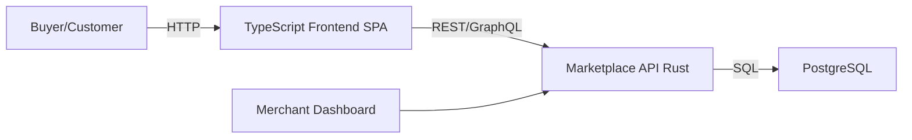
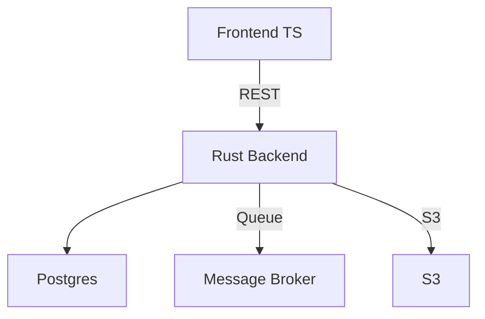
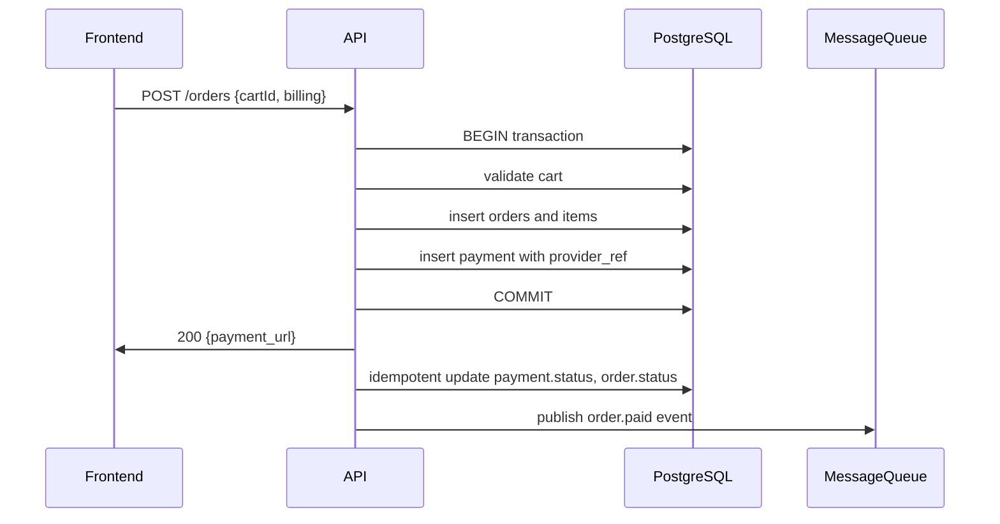
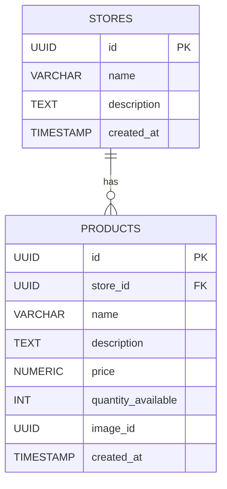
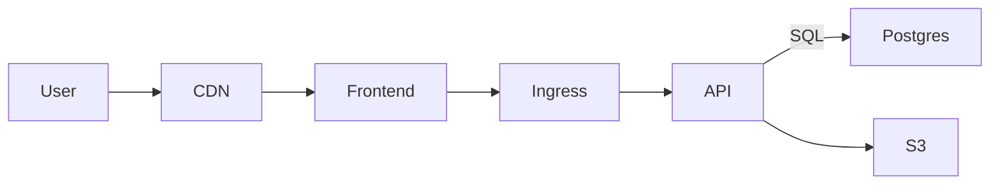

# 1. Introduction and Goals

**Purpose.** Provide a complete architecture blueprint (arc42) for implementing a marketplace product: buyer-facing frontend (TypeScript), backend services (Rust), and PostgreSQL DB. This doc supports design, development, ops, and review.

**Main goals**

* Data integrity and ACID consistency for orders/payments.
* Scalable: handle bursts of shoppers.
* Maintainable, testable Rust backend with clear module boundaries.
* Deployable to cloud (Kubernetes) and operable (monitoring, backups).

**Stakeholders**

* Product owner, developers (frontend/backend), DevOps, QA, merchants (stores), end users (buyers), payments provider, legal/security.

---

# 2. Constraints and Context Conditions

**Technical constraints**

* Frontend must be TypeScript (React or equivalent).
* Backend must be Rust (axum ).
* PostgreSQL as relational DB.
* Prefer containerized deployment (Docker + Kubernetes).

**Organizational**

* Team of full-stack engineers and DevOps.
* Continuous Delivery pipeline expected.

**Non-functional constraints**

* GDPR / local data protection compliance.
* Target latency: page loads < 300ms (cached pages); API p95 < 200ms.

---

# 3. Context and Scope (System Context)

**In-scope**

* Product catalog, stores management, cart, merchant dashboards.

**Out-of-scope**

* Logistics (shipping provider integrations) — may be added later as external connectors.

Mermaid: high-level context



---

# 4. Solution Strategy

**Key principles**

* Single backend service (monolith or modular monolith) in Rust initially for simplicity; prepare design to split into microservices later if needed.
* Use PostgreSQL to model entities using normalized design (ER from sketch).
* API design: RESTful or GraphQL (recommend REST for simplicity; GraphQL optional for complex queries).
* Strong transactional boundaries around checkout / order creation (use DB transactions).
* Event-driven patterns for asynchronous work (emails, inventory sync, analytics) via durable queue (e.g., RabbitMQ / Kafka / Redis Streams).
* Secure by default: TLS everywhere, JWT Access tokens, role-based access control (merchant/admin/customer).
* Container-first and infra as code for reproducible deployments.

---

# 5. Building Block View (Static)

Below are the major components with responsibilities.

## 5.1 Frontend (TypeScript)

* Framework: React + TypeScript (or Vite/Next.js if SSR required).
* Responsibilities: product listing, product page, cart UI, checkout flow, user auth, merchant dashboard.
* Communicates with backend via HTTPS JSON APIs. Uses CDN for static assets and caches product listing via client-side caching.
* Local storage: temporary cart for unauthenticated users; sync to server on login or at checkout.

## 5.2 Backend (Rust)

**Top-level modules**

* `api` — HTTP handlers (actix-web/axum).
* `auth` — authentication & authorization (JWT / OAuth integration).
* `catalog` — stores and products endpoints and business logic.
* `cart` — cart lifecycle, merging guest carts, cart validation.
* `orders` — order creation, validation, status transitions.
* `payments` — payment session creation, webhook handling (idempotent).
* `events` — enqueue/consume domain events for async tasks.
* `db` — data access layer (sqlx or diesel), migrations.
* `metrics` — Prometheus metrics / tracing instrumentation.

**Interface**

* Expose REST endpoints (JSON) with OpenAPI specification.

## 5.3 Database (PostgreSQL)

* Relational schema (see Appendix A).
* Strong use of transactions, foreign keys, constraints, indices.
* Use `pglogical` or logical replication for read-scaling if needed.

## 5.4 Auxiliary / Infrastructure

* Message broker (RabbitMQ / Redis Streams) for async tasks.
* Object storage (S3) for product images.
* CI/CD (GitHub Actions / Gitlab CI).
* Kubernetes cluster for production.
* Monitoring/Logging (Prometheus, Grafana, Loki, Sentry).

Mermaid: component diagram (simplified)



---

# 6. Runtime View (Example Flows)

## 6.1 Browse + Add to Cart

1. User requests product list → Frontend GET `/stores/:id/products`.
2. Backend queries read replica or primary → returns JSON.
3. User clicks Add to Cart → Frontend POST `/carts/:cartId/items` (creates cart if absent).

Sequence (mermaid)



---

# 7. Data Model (ER + DB)

**Entities from sketch**

* `stores`, `products`, `carts`, `cart_items`, `orders`, `order_items`, `payments`, `users`, `addresses`.

Mermaid ER (refined)



**DB design notes**

* Use `UUID` PKs.
* Use `unit_price` on cart/order items to prevent price drift.
* Add `version` or `updated_at` for optimistic concurrency where needed.
* Indexes on `products(store_id)`, `cart_items(cart_id)`, `orders(user_id)`, `payments(provider_ref)`.

---

# 8. Component Interfaces & APIs

**REST endpoint examples**

* `GET /stores`
* `GET /stores/:storeId/products`
* `GET /products/:id`
* 
**Idempotency**

* `POST /orders` should accept an `Idempotency-Key` header to avoid duplicate orders.
* Webhook handlers must be idempotent: check existing `payment` by provider\_ref.

---

# 9. Cross-cutting Concerns

## 9.1 Security

* TLS for all endpoints.
* Input validation and strict JSON schemas.
* Rate limiting per IP / per user.
* CSRF protection for cookie flows.
* Payment PCI scope: use payment provider hosted page (Stripe Checkout) to minimize PCI scope.
* Secrets in vault (HashiCorp Vault / cloud secret manager).
* Regular dependency scanning.

## 9.2 Testing

* Unit tests for Rust modules.
* Integration tests hitting a test DB (docker compose).
* End-to-end tests (Playwright / Cypress) for critical flows (checkout).
* Contract tests for API (OpenAPI + schema tests).
* Chaos testing for resilience under errors (optional).

## 9.3 Observability

* Structured logs (JSON), export to Loki/ELK.
* Metrics (Prometheus): request latencies, error rates, order success, payments/sec.
* Tracing (OpenTelemetry).
* Alerts: high error rate, payment failure spike, DB connections near limit.

## 9.4 Scalability & Performance

* Stateless API instances behind autoscaling (k8s HPA).
* Caching: CDN + server-side caching for product lists (Redis or HTTP cache).
* Read replicas for Postgres for high read traffic.
* Batch/async non-critical work via MQ.

---

# 10. Deployment View

**Environments**

* `dev` (local), `ci`, `staging`, `prod`.

**Containers**

* Build backend into Docker image (multi-stage build, small distroless).
* Frontend deployed to CDN (or container for SSR).
* Postgres in managed RDS/Cloud SQL.
* MQ as managed service or k8s statefulset.

**Kubernetes**

* Deploy API as Deployment + Service.
* Ingress controller for TLS termination (Let’s Encrypt via cert-manager or cloud-managed certs).
* Horizontal autoscaling based on CPU / request latency.

Mermaid: simplified deployment layout



---

# 11. Quality Scenarios (Architecturally significant)

For each, include acceptance criteria and mitigations.

1. **Checkout atomicity (Critical)**

    * Scenario: Many users checkout same product.
    * Requirement: No oversell for tracked inventory.
    * Solution: DB transaction + `SELECT FOR UPDATE` or optimistic locking; inventory decrement in same transaction. Tests: concurrency test with 100 parallel checkouts; inventory never negative.

2. **Payment webhook reliability (High)**

    * Scenario: Payment provider retries webhook.
    * Requirement: No duplicate state updates.
    * Solution: Idempotent update using provider\_ref and DB unique constraints.

3. **Traffic spike (High)**

    * Scenario: Flash sale causes 10x traffic.
    * Requirement: System stays functional for read paths.
    * Solution: Read replicas, CDN, rate-limiting for checkout, queue backpressure for non-critical tasks.

4. **Data loss / backup (Critical)**

    * Scenario: DB corruption/accidental delete.
    * Requirement: Recovery RTO < 1 hour, RPO < 24h (or better depending on business).
    * Solution: Automated point-in-time backups (cloud), transaction log retention.

5. **Security breach (Critical)**

    * Scenario: Compromised API keys.
    * Requirement: Rapid key rotation, minimum blast radius.
    * Solution: Secrets manager, short-lived keys, audit logs, segmented roles.

---

# 12. Risks, Technical Debt & Mitigation

**Risks**

* Single Rust monolith may slow iteration for big teams — mitigate by modular design and clear boundaries.
* Inventory race conditions — mitigate with strong tests and DB locking.
* Payment provider outage — implement retry/backoff; inform user and allow order to be in `payment_pending` state.
* Misconfigured webhooks → lost payments — monitor webhook delivery and provide UI for manual reconciliation.

**Technical debt**

* Initial minimal search/filter capabilities — plan to add search engine (ElasticSearch) later.
* No multi-tenant merchant features initially — track as backlog.

---

# 13. Architecture Decisions (Selected)

1. **Rust backend (axum/actix-web) over Node.js** — reasons: performance, reliability, memory efficiency.
2. **PostgreSQL relational DB** — reasons: strong ACID guarantees for orders, relational nature of domain.
3. **Single service (modular monolith) initially** — reduce distributed system complexity.
4. **Payment via provider hosted pages** — reduce PCI scope, faster integration.
5. **UUID keys for entities** — global uniqueness, easier to merge data later.

---

# 14. Appendix A — Database DDL (skeleton)

```sql
CREATE EXTENSION IF NOT EXISTS "uuid-ossp";

CREATE TABLE stores (
  id UUID PRIMARY KEY DEFAULT uuid_generate_v4(),
  name TEXT NOT NULL,
  description TEXT,
  created_at TIMESTAMP WITH TIME ZONE DEFAULT now()
);

CREATE TABLE products (
  id UUID PRIMARY KEY DEFAULT uuid_generate_v4(),
  store_id UUID NOT NULL REFERENCES stores(id),
  sku TEXT,
  name TEXT NOT NULL,
  description TEXT,
  price NUMERIC(12,2) NOT NULL,
  quantity_available INT NOT NULL DEFAULT 0,
  created_at TIMESTAMP WITH TIME ZONE DEFAULT now()
);

CREATE TABLE users (
  id UUID PRIMARY KEY DEFAULT uuid_generate_v4(),
  email TEXT UNIQUE NOT NULL,
  name TEXT,
  password_hash TEXT,
  created_at TIMESTAMP WITH TIME ZONE DEFAULT now()
);

CREATE TABLE carts (
  id UUID PRIMARY KEY DEFAULT uuid_generate_v4(),
  user_id UUID REFERENCES users(id),
  converted BOOLEAN DEFAULT false,
  created_at TIMESTAMP WITH TIME ZONE DEFAULT now()
);

CREATE TABLE cart_items (
  id UUID PRIMARY KEY DEFAULT uuid_generate_v4(),
  cart_id UUID REFERENCES carts(id) ON DELETE CASCADE,
  product_id UUID REFERENCES products(id),
  quantity INT NOT NULL,
  unit_price NUMERIC(12,2) NOT NULL
);

CREATE TABLE orders (
  id UUID PRIMARY KEY DEFAULT uuid_generate_v4(),
  user_id UUID REFERENCES users(id),
  cart_id UUID REFERENCES carts(id),
  status TEXT NOT NULL,
  total_amount NUMERIC(12,2) NOT NULL,
  created_at TIMESTAMP WITH TIME ZONE DEFAULT now()
);

CREATE TABLE order_items (
  id UUID PRIMARY KEY DEFAULT uuid_generate_v4(),
  order_id UUID REFERENCES orders(id) ON DELETE CASCADE,
  product_id UUID REFERENCES products(id),
  quantity INT NOT NULL,
  unit_price NUMERIC(12,2) NOT NULL
);

CREATE TABLE payments (
  id UUID PRIMARY KEY DEFAULT uuid_generate_v4(),
  order_id UUID REFERENCES orders(id),
  provider_ref TEXT UNIQUE,
  status TEXT,
  amount NUMERIC(12,2),
  processed_at TIMESTAMP WITH TIME ZONE
);
```

---

# 15. Appendix B — Example API contract (OpenAPI-style summary)

* `POST /orders`
  Body: `{ "cartId": "uuid", "billing": {...}, "shipping": {...} }`
  Response: `{ "orderId": "uuid", "paymentUrl": "https://..." }`

* `POST /payments/webhook`
  Validate provider signature; return `200 OK` quickly; process in background.

---

# 16. Appendix C — CI/CD & Migrations

* CI pipeline: build & test Rust unit & integration tests, run linters, build Docker image.
* DB migrations: use `sqlx` migrations or `refinery`/`liquibase` — run migrations in CI and in deployment pre-rollout.
* Canary deploys: use k8s rolling updates with readiness/liveness probes.

---

# 17. Appendix D — Backups & Disaster Recovery

* Use managed Postgres snapshots daily + WAL archiving for PITR.
* Test restore monthly. Document RTO/RPO.
* Backup S3 content separately with lifecycle.

---

# 18. Appendix E — Monitoring & SLOs

* SLO examples:

    * API availability 99.9% monthly.
    * Order creation latency p95 < 500ms.
    * Payment success rate > 99% (excluding payment provider failures).
* Alerts for: 5xx spikes, DB replication lag, payment webhook failures.

---

# 19. Next Steps (Practical roadmap)

1. **MVP scope**

    * Catalog browse, cart, checkout with Stripe Checkout, order history, merchant product CRUD.
2. **Sprint 1**

    * Scaffolding: repo, CI, Dockerfiles, k8s manifests, DB migrations.
    * Implement basic `stores`, `products` endpoints and frontend list pages.
3. **Sprint 2**

    * Cart flows, cart persistence, merge guest/owner carts.
4. **Sprint 3**

    * Orders + payments integration + webhook handling.
5. **Sprint 4**

    * Monitoring, logging, backups, hardening security.
6. **Later**

    * Inventory alerts, search, merchant dashboard, analytics, shipping integrations.

